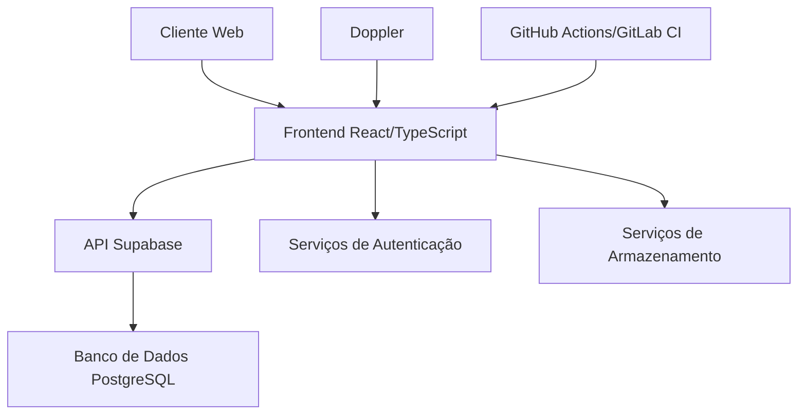
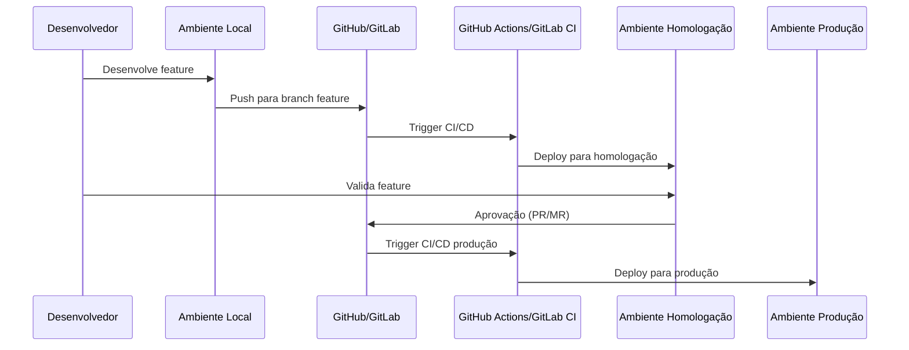

# Design Document

## Overview

Este documento descreve o design para o fluxo de desenvolvimento e implantação do sistema de gerenciamento de profissionais e suas habilidades. O sistema será estruturado em componentes modulares, com um fluxo de trabalho claro para desenvolvimento local, homologação e produção, garantindo a segurança dos dados sensíveis através do Doppler e integrando-se com GitHub e GitLab para publicação.

## Arquitetura

### Visão Geral da Arquitetura

A arquitetura do sistema é baseada em uma aplicação React com TypeScript, utilizando Vite como bundler. O sistema segue uma arquitetura de componentes, com separação clara de responsabilidades:



### Ambientes

O sistema terá três ambientes distintos:

1. **Desenvolvimento**
   - Ambiente local do desenvolvedor
   - Conectado ao banco de dados de produção do Supabase (somente leitura)
   - Configuração via Doppler

2. **Homologação**
   - Ambiente para testes e validação
   - Conectado ao banco de dados de homologação do Supabase
   - Deploy via GitHub Actions/GitLab CI
   - Configuração via Doppler

3. **Produção**
   - Ambiente final para usuários
   - Conectado ao banco de dados de produção do Supabase
   - Deploy via GitHub Actions/GitLab CI
   - Configuração via Doppler

### Fluxo de Desenvolvimento e Deploy



## Componentes e Interfaces

### Estrutura de Componentes

O sistema será organizado em componentes reutilizáveis, seguindo uma estrutura modular:

1. **Componentes de UI**
   - Componentes básicos (botões, inputs, cards, etc.)
   - Componentes de layout (containers, grids, etc.)
   - Componentes de feedback (toasts, alerts, etc.)

2. **Componentes de Negócio**
   - Formulários de cadastro de profissionais
   - Visualização de profissionais
   - Importação de dados via Excel
   - Dashboard de análise

3. **Serviços**
   - Integração com Supabase
   - Gerenciamento de autenticação
   - Serviços de armazenamento
   - Serviços de análise

### Interfaces de Componentes

```typescript
// Interface para Profissional
interface Professional {
  id: string;
  email: string | null;
  area_atuacao: string | null;
  skill_principal: string | null;
  nivel_experiencia: string | null;
  // ... outros campos conforme definido em src/types/Professional.ts
}

// Interface para Componente de Formulário
interface ManualFormProps {
  onSubmit: (data: Professional) => Promise<void>;
  initialData?: Professional;
  isLoading?: boolean;
}

// Interface para Componente de Importação Excel
interface ExcelImportProps {
  onImport: (data: Professional[]) => Promise<void>;
  isLoading?: boolean;
}

// Interface para Cliente Supabase
interface SupabaseClient {
  from: (table: string) => {
    select: (columns?: string) => Promise<{ data: any[], error: any }>;
    insert: (data: any) => Promise<{ data: any, error: any }>;
    update: (data: any) => Promise<{ data: any, error: any }>;
    delete: () => Promise<{ data: any, error: any }>;
  };
}
```

## Data Models

### Modelo de Dados Principal

O sistema utiliza o Supabase como backend, com a seguinte estrutura de tabela principal:

```sql
CREATE TABLE colaboradores (
  id BIGSERIAL PRIMARY KEY,
  created_at TIMESTAMPTZ DEFAULT NOW(),
  nome_completo TEXT NOT NULL,
  email TEXT UNIQUE NOT NULL,
  area_atuacao TEXT NOT NULL,
  skill_principal TEXT NOT NULL,
  nivel_experiencia TEXT NOT NULL,
  disponivel_compartilhamento BOOLEAN DEFAULT false,
  percentual_compartilhamento INTEGER DEFAULT 0,
  outras_skills TEXT[],
  hora_ultima_modificacao TIMESTAMPTZ DEFAULT NOW(),
  regime TEXT,
  local_alocacao TEXT,
  proficiencia_cargo TEXT,
  java TEXT,
  javascript TEXT,
  python TEXT,
  typescript TEXT,
  php TEXT,
  dotnet TEXT,
  react TEXT,
  angular TEXT,
  ionic TEXT,
  flutter TEXT,
  mysql TEXT,
  postgres TEXT,
  oracle_db TEXT,
  sql_server TEXT,
  mongodb TEXT,
  aws TEXT,
  azure TEXT,
  gcp TEXT,
  outras_tecnologias TEXT,
  android TEXT,
  cobol TEXT,
  linguagem_r TEXT,
  linguagem_c TEXT,
  linguagem_cpp TEXT,
  windows TEXT,
  raspberry_pi TEXT,
  arduino TEXT,
  gerencia_projetos TEXT,
  administracao_projetos TEXT,
  analise_requisitos TEXT,
  gestor_area TEXT,
  gestor_direto TEXT
);
```

### Modelo de Configuração de Ambientes

Para gerenciar os diferentes ambientes, utilizaremos arquivos de configuração específicos:

```typescript
// Estrutura de configuração de ambiente
interface EnvironmentConfig {
  supabaseUrl: string;
  supabaseAnonKey: string;
  environment: 'development' | 'homologacao' | 'production';
  appTitle: string;
  apiEndpoints: {
    [key: string]: string;
  };
}

// Configurações específicas por ambiente
const configs: Record<string, EnvironmentConfig> = {
  development: {
    // Configuração de desenvolvimento
  },
  homologacao: {
    // Configuração de homologação
  },
  production: {
    // Configuração de produção
  }
};
```

## Error Handling

### Estratégia de Tratamento de Erros

O sistema implementará uma estratégia abrangente de tratamento de erros:

1. **Erros de API**
   - Captura e log de erros de comunicação com o Supabase
   - Feedback visual para o usuário
   - Tentativas automáticas de reconexão

2. **Erros de Validação**
   - Validação de formulários com feedback imediato
   - Validação de dados importados do Excel
   - Prevenção de dados duplicados

3. **Erros de Autenticação**
   - Tratamento de tokens expirados
   - Redirecionamento para login quando necessário
   - Proteção contra acessos não autorizados

### Implementação de Logs

```typescript
// Sistema de log centralizado
const logError = (error: Error, context?: any) => {
  console.error(`[${new Date().toISOString()}] Error:`, error.message, context);
  
  // Enviar para serviço de monitoramento (opcional)
  if (import.meta.env.PROD) {
    // Enviar para Sentry ou similar
  }
};

// Exemplo de uso com Supabase
const fetchData = async () => {
  try {
    const { data, error } = await supabase.from('colaboradores').select('*');
    
    if (error) {
      throw new Error(`Supabase error: ${error.message}`);
    }
    
    return data;
  } catch (err) {
    logError(err, { component: 'DataFetcher', action: 'fetchData' });
    throw err; // Re-throw para tratamento no componente
  }
};
```

## Testing Strategy

### Abordagem de Testes

O sistema utilizará uma abordagem de testes em múltiplas camadas:

1. **Testes Unitários**
   - Testes de componentes isolados
   - Testes de funções utilitárias
   - Testes de validação

2. **Testes de Integração**
   - Testes de integração com Supabase
   - Testes de fluxos completos
   - Testes de formulários

3. **Testes de Segurança**
   - Verificação de vulnerabilidades
   - Testes de injeção de SQL
   - Verificação de exposição de dados sensíveis

### Implementação de Testes de Segurança

```typescript
// Exemplo de script de verificação de segurança
const securityCheck = () => {
  // Verificar se há chaves expostas
  const result = execSync('grep -r "VITE_SUPABASE" . --exclude-dir=node_modules --exclude-dir=.git');
  
  if (result.toString().trim()) {
    console.error('❌ Chaves do Supabase encontradas no código!');
    process.exit(1);
  }
  
  // Verificar vulnerabilidades de dependências
  const npmAudit = execSync('npm audit --audit-level=critical');
  
  if (npmAudit.toString().includes('critical')) {
    console.error('❌ Vulnerabilidades críticas encontradas!');
    process.exit(1);
  }
  
  console.log('✅ Verificação de segurança concluída com sucesso!');
};
```

## Integração com Repositórios

### GitHub

1. **GitHub Actions**
   - Workflow para testes de segurança
   - Workflow para deploy em homologação
   - Workflow para deploy em produção
   - Integração com Doppler para segredos

2. **GitHub Pages**
   - Publicação da aplicação
   - Configuração de domínio personalizado

### GitLab

1. **GitLab CI/CD**
   - Pipeline para testes
   - Pipeline para deploy
   - Integração com Doppler para segredos

2. **GitLab Pages**
   - Publicação da aplicação
   - Configuração de domínio personalizado

## Gestão de Segredos com Doppler

### Configuração do Doppler

1. **Projetos no Doppler**
   - Projeto para desenvolvimento
   - Projeto para homologação
   - Projeto para produção

2. **Variáveis de Ambiente**
   - `VITE_SUPABASE_URL`
   - `VITE_SUPABASE_ANON_KEY`
   - Outras variáveis sensíveis

3. **Integração com CI/CD**
   - Token de serviço para GitHub Actions
   - Token de serviço para GitLab CI

## Documentação Centralizada

### Estrutura da Documentação

A documentação centralizada será organizada da seguinte forma:

1. **Visão Geral**
   - Descrição do projeto
   - Objetivos
   - Tecnologias utilizadas

2. **Guias**
   - Guia de desenvolvimento
   - Guia de deploy
   - Guia de segurança

3. **Referências**
   - API do Supabase
   - Componentes
   - Modelos de dados

4. **Procedimentos**
   - Configuração de ambiente
   - Deploy manual
   - Troubleshooting

### Formato da Documentação

A documentação será mantida em formato Markdown, organizada em arquivos separados por tópico, e consolidada em um documento principal para fácil navegação.